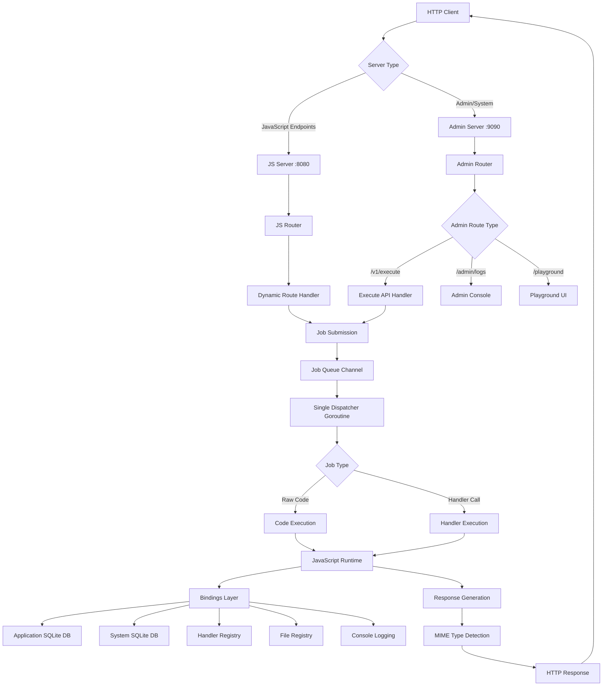

# JavaScript Playground Server - Architecture & Internals

## Overview

The JavaScript Playground Server is a Go-native web server that provides a dynamic JavaScript runtime with SQLite integration. It allows you to create, modify, and execute JavaScript code that can register HTTP endpoints, query databases, and serve content with proper MIME types - all at runtime.

## Architecture

The server uses a dual-port architecture with separate HTTP servers:
- **JavaScript Server (Port 8080)**: Serves user-defined endpoints registered via JavaScript
- **Admin Server (Port 9090)**: Serves system interfaces, playground, API, and admin tools

Both servers share the same JavaScript engine and follow a single-threaded execution model to ensure thread safety while maintaining high performance for moderate request loads.



## Core Components

### 1. Engine (`internal/engine/engine.go`)

The `Engine` is the central component that manages:
- **JavaScript Runtime**: Goja-based V8-compatible JavaScript engine
- **SQLite Connection**: Direct database access for queries
- **Job Queue**: Channel-based job submission system
- **Handler Registry**: Maps HTTP routes to JavaScript functions
- **File Registry**: Maps file paths to JavaScript file handlers

```go
type Engine struct {
    rt       *goja.Runtime
    db       *sql.DB
    jobs     chan EvalJob
    handlers map[string]map[string]*HandlerInfo
    files    map[string]goja.Callable
    mu       sync.RWMutex
}
```

### 2. Dispatcher (`internal/engine/dispatcher.go`)

The Dispatcher runs in a single goroutine and processes all JavaScript execution sequentially:
- **Thread Safety**: Only one goroutine accesses the JavaScript runtime
- **Job Processing**: Handles both raw code execution and HTTP handler calls
- **Error Recovery**: Panic recovery with proper error reporting
- **Response Handling**: Converts JavaScript results to HTTP responses

```go
type EvalJob struct {
    Handler *HandlerInfo         // Pre-registered handler (nil for raw code)
    Code    string              // JavaScript code to execute
    W       http.ResponseWriter // Response writer
    R       *http.Request       // HTTP request
    Done    chan error          // Completion signal
}
```

### 3. Express.js Bindings (`internal/engine/bindings.go`)

The Bindings layer provides a comprehensive Express.js compatible API to JavaScript:

#### Core Express.js API
- **Route Methods**: `app.get()`, `app.post()`, `app.put()`, `app.delete()`, `app.patch()` for HTTP method routing
- **Middleware**: `app.use()` for middleware registration (basic implementation)
- **Request Object**: Express.js compatible `req` object with `params`, `query`, `body`, `headers`, `cookies`, `ip`, etc.
- **Response Object**: Full `res` object with `send()`, `json()`, `status()`, `redirect()`, `set()`, `cookie()`, `end()`

#### Database Integration
- **SQL Operations**: `db.query()` with automatic parameter binding and type conversion
- **Transaction Support**: Built-in SQLite transaction handling
- **Parameter Flattening**: JavaScript arrays automatically converted to SQL parameters

#### Development Tools
- **Console API**: Full console support (`console.log`, `console.error`, `console.warn`, `console.debug`)
- **JSON Utilities**: Native `JSON.stringify()` and `JSON.parse()` support
- **Global State**: Persistent `globalState` object that survives code executions
- **Legacy Support**: Backward compatible `registerHandler()` and `registerFile()` APIs

### 4. Web Layer (`internal/web/router.go`)

Handles dynamic routing for JavaScript-registered endpoints:
- **Route Matching**: Checks registered handlers and files
- **Job Submission**: Converts HTTP requests to evaluation jobs
- **404 Handling**: Falls back to 404 for unregistered routes

### 5. API Layer (`internal/api/execute.go`)

Provides the `/v1/execute` endpoint for code execution:
- **Database Storage**: Stores executed code, results, and errors in SQLite
- **Session Tracking**: Each execution gets a unique session ID for tracking
- **Async Execution**: Non-blocking code submission
- **Response Handling**: Returns execution status and session ID

## Concurrency Model

### Single-Threaded JavaScript Execution

```
HTTP Request 1 ──┐
HTTP Request 2 ──┼──> Job Queue ──> Single Dispatcher ──> JavaScript Runtime
HTTP Request 3 ──┘                                                │
                                                                   ▼
                                                            Sequential Processing
```

**Benefits:**
- Thread safety without locks in JavaScript code
- Predictable execution order
- Simplified state management
- No race conditions in JavaScript variables

**Trade-offs:**
- Moderate throughput (sufficient for most use cases)
- CPU-bound JavaScript can block other requests
- Single point of failure for JavaScript execution

### Scaling Considerations

For higher throughput, you can:
1. **Horizontal Scaling**: Run multiple server instances
2. **Partitioning**: Use consistent hashing to route requests to specific instances
3. **Load Balancing**: Use nginx or similar for request distribution

## Request Flow

### 1. Code Execution Flow

```
1. Client sends POST /v1/execute with JavaScript code
2. API handler generates session ID and creates EvalJob
3. EvalJob submitted to job queue for execution
4. Dispatcher picks up job and executes JavaScript code
5. Execution result, console output, and errors captured
6. All execution data stored in SQLite database with session ID
7. Response sent back to client with result and session ID
```

### 2. Dynamic Route Flow

```
1. Client sends request to registered route (e.g., GET /api/users)
2. Dynamic route handler checks handler registry
3. If handler exists, EvalJob created with handler function
4. Dispatcher executes JavaScript handler with request object
5. Handler result converted to HTTP response with proper MIME type
6. Response sent to client
```

## Database Integration

### Dual Database Architecture

The server uses separate SQLite databases for different purposes:
- **Application Database**: Used by JavaScript code via `db.*` bindings for user data
- **System Database**: Used internally for execution logs, request logs, and engine operations

Both databases can be configured via command line flags:
```bash
# Serve command
js-playground serve --app-db user-data.db --system-db system-logs.db

# MCP command  
js-playground mcp start --app-db app.db --system-db sys.db
```

### SQLite Connections

JavaScript code accesses the application database through the `db.*` bindings:

```javascript
// JavaScript can query the database directly
const users = db.query("SELECT * FROM users WHERE active = ?", [true]);
const count = db.query("SELECT COUNT(*) as total FROM users")[0].total;
```

### Script Execution Storage

All JavaScript code executions are automatically stored in the `script_executions` table in the **system database**:

```sql
CREATE TABLE script_executions (
    id INTEGER PRIMARY KEY AUTOINCREMENT,
    session_id TEXT NOT NULL,
    code TEXT NOT NULL,
    result TEXT,
    console_log TEXT,
    error TEXT,
    timestamp DATETIME DEFAULT CURRENT_TIMESTAMP,
    source TEXT DEFAULT 'api'
);
```

**Stored Data:**
- **Session ID**: Unique identifier for each execution
- **Code**: The executed JavaScript code
- **Result**: JSON-serialized execution result 
- **Console Log**: Captured console output
- **Error**: Any execution errors
- **Source**: Execution source ('api', 'mcp', 'file')

### Parameter Handling

The binding layer automatically flattens JavaScript arrays for SQL parameters:

```javascript
// JavaScript arrays are flattened automatically
db.query("INSERT INTO users (name, email) VALUES (?, ?)", ["John", "john@example.com"]);

// Equivalent to the SQL call:
// db.Query("INSERT INTO users (name, email) VALUES (?, ?)", "John", "john@example.com")
```

## Code Isolation

### Script Wrapping

All JavaScript code is wrapped in an Immediately Invoked Function Expression (IIFE) to prevent variable conflicts:

```javascript
// Original code:
let counter = 0;
registerHandler("GET", "/count", () => ({count: ++counter}));

// Wrapped code:
(function() {
    "use strict";
    let counter = 0;
    registerHandler("GET", "/count", () => ({count: ++counter}));
})();
```

### Global State Persistence

The `globalState` object persists across script executions:

```javascript
// Initialize persistent state
if (!globalState.apiCounter) {
    globalState.apiCounter = 0;
}

// Use persistent state
registerHandler("GET", "/api/status", () => ({
    requests: ++globalState.apiCounter
}));
```

## MIME Type Support

The server automatically handles content types through Express.js response methods:

### Express.js Response Methods
- `res.send(html)` → Auto-detects content type (HTML/text/JSON)
- `res.json(data)` → `application/json`
- `res.set('Content-Type', 'text/css')` → Custom content type

### Express.js Style Examples
```javascript
// JSON response
app.get("/api/data", (req, res) => res.json(data));

// CSS file
app.get("/styles.css", (req, res) => {
    res.set('Content-Type', 'text/css');
    res.send(cssContent);
});

// SVG image
app.get("/logo.svg", (req, res) => {
    res.set('Content-Type', 'image/svg+xml');
    res.send(svgContent);
});
```

## Logging System

### Structured Logging with Zerolog

The server uses structured logging with configurable levels:

```bash
# Set log level (trace, debug, info, warn, error, fatal, panic)
./js-playground serve --log-level debug
```

### JavaScript Console Integration

JavaScript console methods are integrated with the Go logging system:

```javascript
console.log("Info message");    // → log.Info()
console.error("Error message"); // → log.Error()
console.debug("Debug message"); // → log.Debug()
```

## CLI Usage

### Commands

```bash
# Start server with default ports (JS: 8080, Admin: 9090)
js-playground serve --app-db user-data.db --system-db logs.db --scripts scripts/

# Start server with custom ports
js-playground serve --port 8081 --admin-port 9091 --app-db app.db --system-db sys.db

# Execute code from file or string (uses admin port)
js-playground execute script.js --url http://localhost:9090
js-playground execute "console.log('Hello')" --url http://localhost:9090

# Test server endpoints
js-playground test --url http://localhost:9090

# Start MCP server
js-playground mcp start --js-port 8080 --admin-port 9090
```

### Flags

- `--port, -p`: JavaScript server HTTP port (default: 8080)
- `--admin-port`: Admin interface HTTP port (default: 9090)
- `--app-db, -d`: Application SQLite database path (default: data.sqlite)
- `--system-db`: System SQLite database path (default: system.sqlite)
- `--scripts, -s`: Directory to load JavaScript files from on startup
- `--log-level`: Logging level (default: debug)
- `--url, -u`: Server URL for client commands

## Configuration

### Environment Setup

```bash
# Development
export LOG_LEVEL=debug
export DB_PATH=dev.sqlite
export PORT=8080

# Production
export LOG_LEVEL=info
export DB_PATH=/data/production.sqlite
export PORT=80
```

### Bootstrap Configuration

The server automatically creates a `bootstrap.js` file with default handlers:

```javascript
let globalCounter = 0;

registerHandler("GET", "/", () => "JS playground online");
registerHandler("GET", "/health", () => ({ok: true, counter: globalCounter}));
registerHandler("POST", "/counter", () => ({count: ++globalCounter}));
```

## Security Considerations

### Sandboxing

- JavaScript code runs in a Goja sandbox (no file system access by default)
- No network access from JavaScript (only through provided APIs)
- Database access is limited to the configured SQLite database

### Input Validation

- SQL injection protection through parameterized queries
- HTTP input sanitization through Go's standard library
- JavaScript code execution is isolated per request

### Recommended Practices

1. **Database Permissions**: Use a dedicated database user with limited permissions
2. **Network Isolation**: Run in a containerized environment
3. **Rate Limiting**: Add rate limiting middleware for production use
4. **HTTPS**: Use TLS termination at the load balancer level
5. **Monitoring**: Monitor JavaScript execution times and error rates

## Performance Characteristics

### Throughput

- **Moderate RPS**: Suitable for 100-1000 requests/second depending on JavaScript complexity
- **Latency**: Low latency for simple handlers (< 1ms JavaScript execution)
- **Memory**: Efficient memory usage with single JavaScript context

### Scaling Limits

- **CPU Bound**: JavaScript execution is single-threaded
- **Memory**: SQLite and JavaScript heap size
- **Concurrency**: Limited by channel buffer size (default: 1024)

### Optimization Tips

1. **Keep JavaScript Simple**: Complex computations can block other requests
2. **Use Prepared Statements**: Database queries are automatically parameterized
3. **Cache Static Content**: Use `registerFile` for static assets
4. **Monitor Performance**: Use the `/metrics` endpoint for monitoring

## Deployment

### Docker Deployment

```dockerfile
FROM golang:1.22-alpine AS builder
WORKDIR /app
COPY . .
RUN go build -o js-playground ./cmd/experiments/js-web-server

FROM alpine:latest
RUN apk --no-cache add ca-certificates
WORKDIR /root/
COPY --from=builder /app/js-playground .
EXPOSE 8080
CMD ["./js-playground", "serve"]
```

### Systemd Service

```ini
[Unit]
Description=JavaScript Playground Server
After=network.target

[Service]
Type=simple
User=jsserver
WorkingDirectory=/opt/jsserver
ExecStart=/opt/jsserver/js-playground serve -p 8080 -d /data/jsserver.sqlite
Restart=always
RestartSec=10

[Install]
WantedBy=multi-user.target
```

## Troubleshooting

### Common Issues

1. **Port Already in Use**: Change port with `-p` flag
2. **Database Lock**: Ensure only one instance accesses the database
3. **JavaScript Errors**: Check logs for syntax errors and runtime exceptions
4. **Memory Leaks**: Monitor JavaScript global state growth

### Debug Mode

Run with debug logging to see detailed execution flow:

```bash
js-playground serve --log-level debug
```

### Health Monitoring

Use the built-in health endpoints:

```bash
# Check JavaScript server endpoints (user-defined)
curl http://localhost:8080/

# Check admin interface and system endpoints
curl http://localhost:9090/health        # Basic health check  
curl http://localhost:9090/admin/logs    # Admin console
curl http://localhost:9090/playground    # Playground interface
```